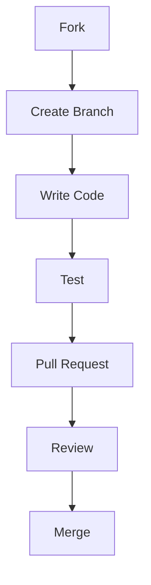

---

# 🚀 CONTRIBUTING.md — Noorify

````markdown


# 🤝 المساهمة في Noorify Engine

> **"معاً نبني أثراً رقمياً يخدم الأمة"**  
> نظام Noorify يعتمد على مجتمع قوي — ومساهمتك جزء أساسي من هذا النجاح.

---

## 🧭 فلسفة المشروع

نحن لا نبني مجرد بوت… بل نبني **نظام رقمي مستدام**.

### المبادئ الأساسية:

- 🧼 **Code Quality First**
- ⚡ **Performance Matters**
- 🧠 **Smart Simplicity**
- 🔁 **Scalable Architecture**

أي مساهمة لا تحترم هذه المبادئ سيتم رفضها.

---

## 🚀 البدء السريع

### 1️⃣ Fork المشروع

```bash
git clone https://github.com/YOUR_USERNAME/Noorify_Bot.git
cd Noorify_Bot
````

---

### 2️⃣ تثبيت المتطلبات

```bash
npm install
```

---

### 3️⃣ تشغيل المشروع

```bash
npm run dev
```

---

## 🧱 أنواع المساهمات

| النوع         | الوصف            |
| ------------- | ---------------- |
| ✨ Feature     | إضافة ميزة جديدة |
| 🐛 Bug Fix    | إصلاح مشكلة      |
| ♻️ Refactor   | تحسين الكود      |
| 📚 Docs       | تحسين التوثيق    |
| ⚡ Performance | تحسين الأداء     |

---

## 🔀 نظام الفروع

| الفرع       | الاستخدام    |
| ----------- | ------------ |
| `main`      | نسخة الإنتاج |
| `dev`       | التطوير      |
| `feature/*` | ميزات        |
| `fix/*`     | إصلاحات      |

### مثال عملي:

```bash
git checkout -b feature/tasbih-ui
```

---

## 📥 Workflow المساهمة



---

## 📌 قواعد الكود (Code Standards)

### 🧼 النظافة

* أسماء واضحة (camelCase)
* دوال صغيرة (Single Responsibility)
* لا تكرار (DRY)

### 🧠 الهيكلة

* فصل الـ Logic عن Commands
* استخدام Modules
* عدم استخدام Hardcoded values

### ⚡ الأداء

* تجنب loops الثقيلة
* استخدم caching عند الحاجة

---

## 🧪 الاختبار

قبل إرسال PR:

```bash
npm run test
```

✔ إذا لا يوجد Tests:

* اختبر يدوياً
* تأكد عدم وجود Errors

---

## 🧩 أسلوب الرسائل (Commit Convention)

```bash
feat: add tasbih progress system
fix: resolve arabic search bug
refactor: optimize database handler
```

---

## 📥 معايير قبول Pull Request

### ✅ سيتم القبول إذا:

* الكود نظيف ومفهوم
* لا يكسر النظام
* PR واضح ومشروح

### ❌ سيتم الرفض إذا:

* كود عشوائي
* بدون اختبار
* تغييرات ضخمة بدون شرح

---

## ⚠️ أخطاء شائعة

* ❌ PR يحتوي أكثر من Feature
* ❌ تجاهل Structure المشروع
* ❌ عدم اختبار الكود
* ❌ نسخ كود بدون فهم

---

## 💡 Feature Request

افتح Issue واكتب:

* المشكلة الحالية
* الحل المقترح
* مثال عملي

---

## 🐞 Bug Report

يرجى تضمين:

* وصف المشكلة
* خطوات إعادة الخطأ
* Logs
* Screenshots

---

## 🛡️ الأمان

🚫 يمنع رفع:

* API Keys
* Tokens
* Secrets

---

## 🧠 نصائح للمساهمين (Pro Tips)

* ابدأ بـ Issues صغيرة
* اقرأ الكود قبل التعديل
* اسأل قبل التغييرات الكبيرة
* اكتب كود كأن شخص غيرك سيقرأه

---

## 👨‍💻 كلمة أخيرة

> **"هذا المشروع صدقة جارية رقمية — فاجعل لك فيه أثراً"**

---


````
