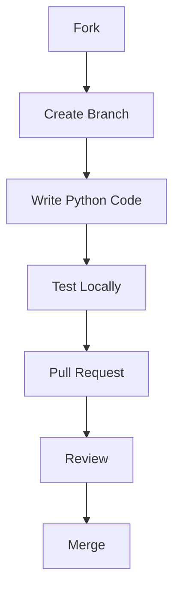

# 🤝 المساهمة في Noorify

> نبني هذا المشروع معاً — خطوة صغيرة منك = أثر كبير

---

## 🧭 فكرة المشروع

هو نظام ذكي لخدمة الذكر،  
مو مجرد بوت عادي — لذلك نشتغل بعقلية:

- جودة قبل السرعة
- بساطة بدون تعقيد
- كود قابل للتطوير (Pythonic Way)
- أداء ثابت ومستقر

---

## 🚀 ابدأ خلال دقيقة

```bash
# 1. استنساخ المستودع
git clone https://github.com/YOUR_USERNAME/Noorify_Bot.git
cd Noorify_Bot

# 2. إنشاء بيئة افتراضية (اختياري ولكن موصى به)
python -m venv venv
source venv/bin/activate  # لنظام Linux/Mac
# أو venv\Scripts\activate لنظام Windows

# 3. تثبيت المتطلبات
pip install -r requirements.txt

# 4. تشغيل المشروع (تأكد من وضع التوكن في متغيرات البيئة)
export BOT_TOKEN="your_token_here"
python bot.py
```

---

## 🧱 أنواع المساهمات

| النوع         | الوصف            |
| ------------- | ---------------- |
| ✨ Feature     | إضافة ميزة جديدة |
| 🐛 Bug Fix    | إصلاح مشكلة      |
| ♻️ Refactor   | تحسين الكود      |
| 📚 Docs       | تحسين التوثيق    |
| ⚡ Performance | تحسين الأداء     |

---

## 🔀 نظام الفروع

| الفرع       | الاستخدام    |
| ----------- | ------------ |
| `main`      | نسخة الإنتاج |
| `dev`       | التطوير      |
| `feature/*` | ميزات جديدة  |
| `fix/*`     | إصلاحات      |

### مثال عملي:

```bash
git checkout -b feature/tasbih-ui-v2
```

---

## 📥 Workflow المساهمة



---

## 📌 قواعد الكود (Code Standards)

### 🧼 النظافة (Clean Code)

* اتبع معايير **PEP 8** الخاصة بلغة Python.
* أسماء واضحة للمتغيرات والدوال (snake_case).
* دوال صغيرة تؤدي وظيفة واحدة (Single Responsibility).

### 🧠 الهيكلة

* فصل المنطق (Logic) في `bot.py` عن النصوص في `constants.py`.
* استخدام الـ Async/Await بشكل صحيح لضمان عدم توقف البوت.
* عدم وضع قيم ثابتة (Hardcoded) داخل الكود، استخدم `constants.py`.

### ⚡ الأداء

* تجنب الحلقات التكرارية (Loops) الثقيلة التي قد تعطل الـ Event Loop.
* استخدم `JobQueue` للمهام المجدولة والتذكيرات.

---

## 🧪 الاختبار

قبل إرسال PR:

* اختبر البوت يدوياً في محادثة خاصة وفي مجموعة.
* تأكد من عدم وجود Errors في الـ Logs.
* تأكد من أن جميع الأزرار (Inline Buttons) تعمل وتؤدي وظيفتها.

---

## 🧩 أسلوب الرسائل (Commit Convention)

```bash
feat: add new dhikr category
fix: resolve pdf download timeout
refactor: optimize reminder scheduler
```

---

## 🛡️ الأمان

🚫 **تحذير هام جداً:**
يمنع منعاً باتاً رفع ملفات تحتوي على:
* `BOT_TOKEN`
* أي مفاتيح API خاصة.
* استخدم دائماً متغيرات البيئة (Environment Variables).

---

## 👨‍💻 كلمة أخيرة

> **"هذا المشروع صدقة جارية رقمية — فاجعل لك فيه أثراً"**

---

<div align="center">
  
</div>
