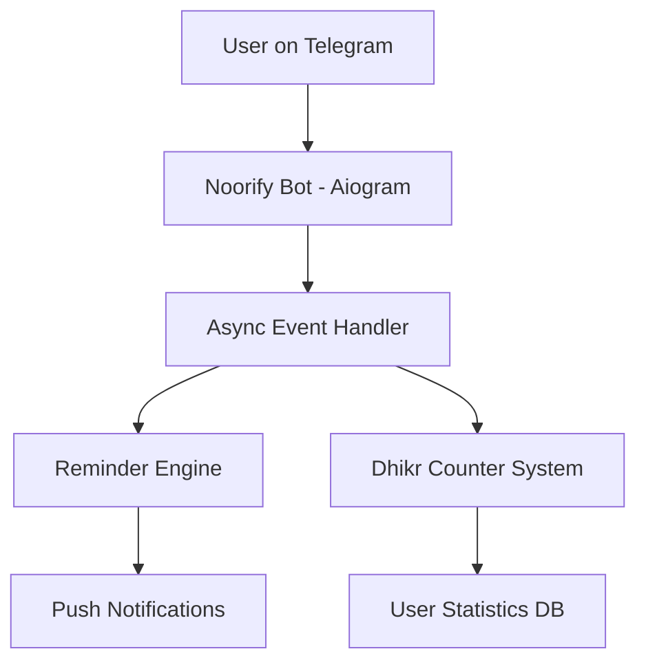

<!-- 🌊 HERO HEADER -->
<p align="center">
  
</p>

<p align="center">
  <b>✨ صدقة جارية رقمية — نحو استخدام أهدأ للهاتف</b><br>
  <sub>تحويل التشتت إلى ذكر • والوقت الضائع إلى أثر</sub>
</p>

---

<!-- BADGES -->
<p align="center">
  
  
  
  
</p>

---

## ⚡ الفكرة

> “ليس الهدف أن تترك هاتفك… بل أن تجعله يذكّرك بالله.”

**Noorify** مشروع ذكي يهدف إلى:
- تقليل التشتت الرقمي
- بناء عادات ذكر مستمرة
- تحويل الهاتف من مصدر ضياع إلى مصدر أجر

---

## 🌙 الرسالة

<p align="center">
  <i>“كل تسبيحة قد تكون سببًا في راحة قلبك”</i>
</p>

---

## 🧠 كيف يعمل النظام


🧩 التقنيات
<p align="center">  </p>


🎯 أهداف المشروع
تقليل الإدمان الرقمي
بناء عادات روحانية مستمرة
تقديم تجربة هادئة داخل تيليجرام
جعل التقنية وسيلة للخير
🤍 صدقة جارية
<p align="center"> <b>إذا استفدت من المشروع فلا تنسَ دعوة صالحة 🤍</b><br> <sub>الدال على الخير كفاعله</sub> </p>
⭐ دعم المشروع
<p align="center"> <a href="https://github.com/your-username/noorify">  </a> </p>
<!-- 🌊 FOOTER --> <p align="center">  </p> ```
